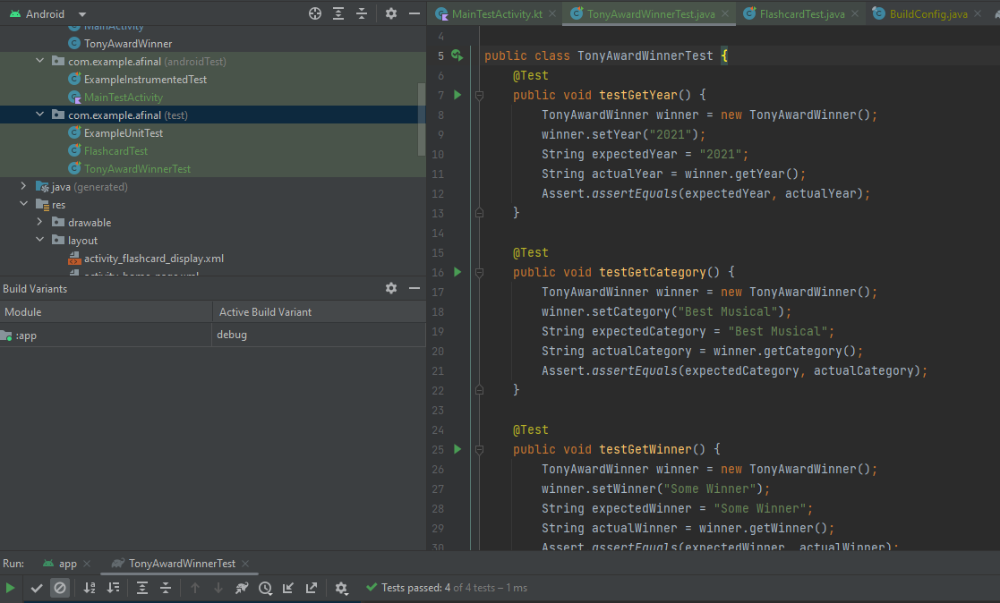

# Java Final App

## Current Activity Options
1. Flashcards Activity
2. Guessing Game Activity

## Flashcards Screenshots

Select a category from the vertical scrolling list:

After selecting a category it will pull up the flashcards, ordered by year:

You can then click the "Flip" button to see the answer:

You navigate to the next card with the "Next Card" button and the "Shuffle" button will shuffle the set.

## Guessing Game Screenshot

The Guessing Game consists of a question pulled from the Tony Award Winner csv file.

The user is presented with 4 choices, one of which is correct, and none of the choices will be the same.

## Testing Screenshots

